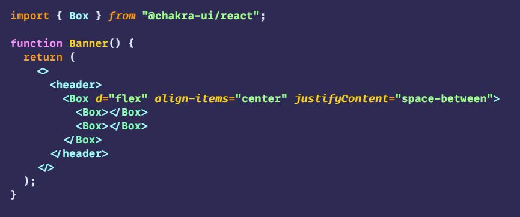
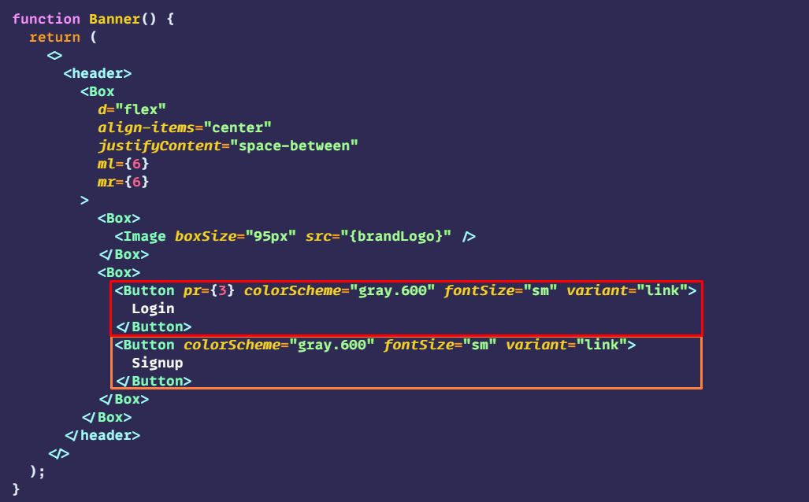

# Chakra UI Clone of Meetup

### See the website
- 
    - 
        - 
    - 
        - 
        
### Getting started
- Getting the basics
    - CRA it
        - 
    - install Chakra
        - 
        - 
    - create folders
        - 
    - Chakra wrapper
        - Before
            - 
        - After
            - 
    - clear up the defaults
        - 
            

### Look at example
- Pickout components
    - 
        - Banner
        - `What do you want to do?` section
        - `See what's happening` section
        - `Upcoming online events` section
        - `Popular Groups` section
        - `Stories from Meetup` section
        - `Footer` section

### Work on Components
- Banner
    - start with a Box
        - 
    - make a div on each end
        - 
    - insert image
        - 
    - Add buttons to the end `Box`
        - 
    - 
        - 
        - 
        - 